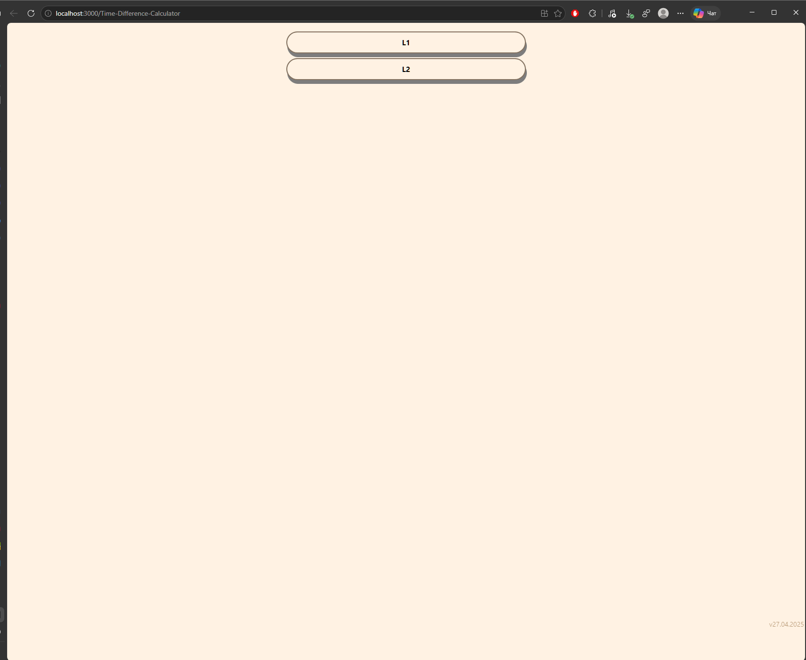
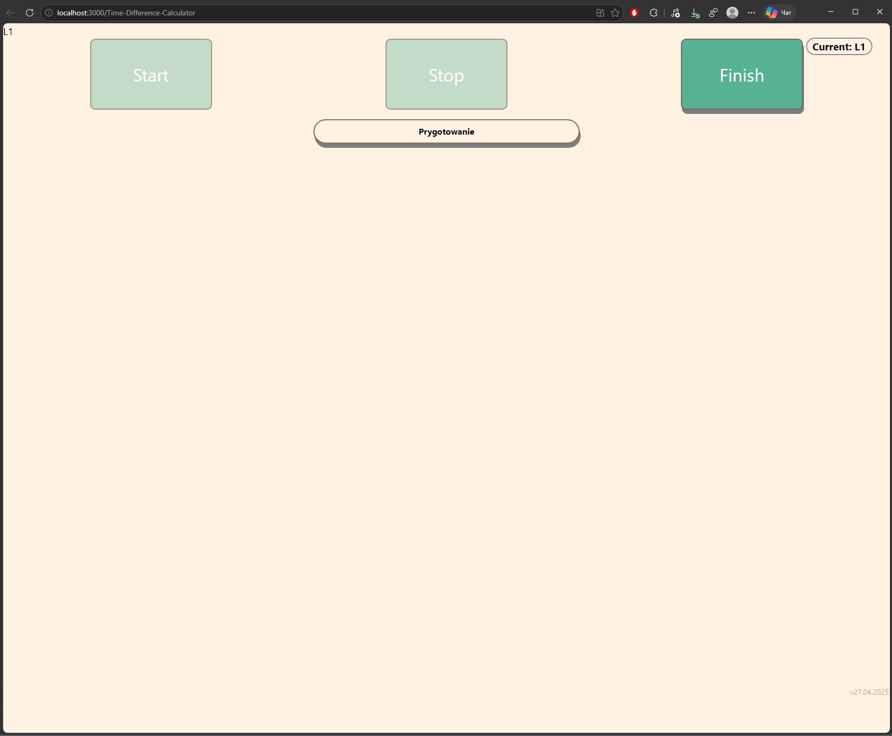
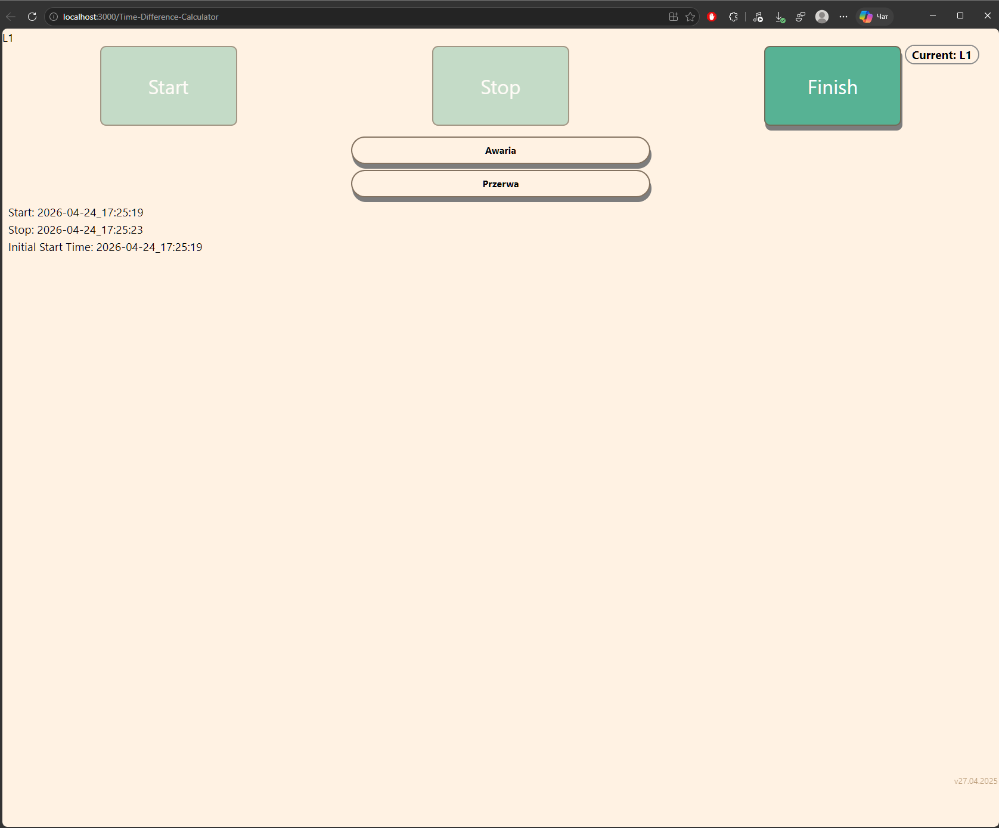
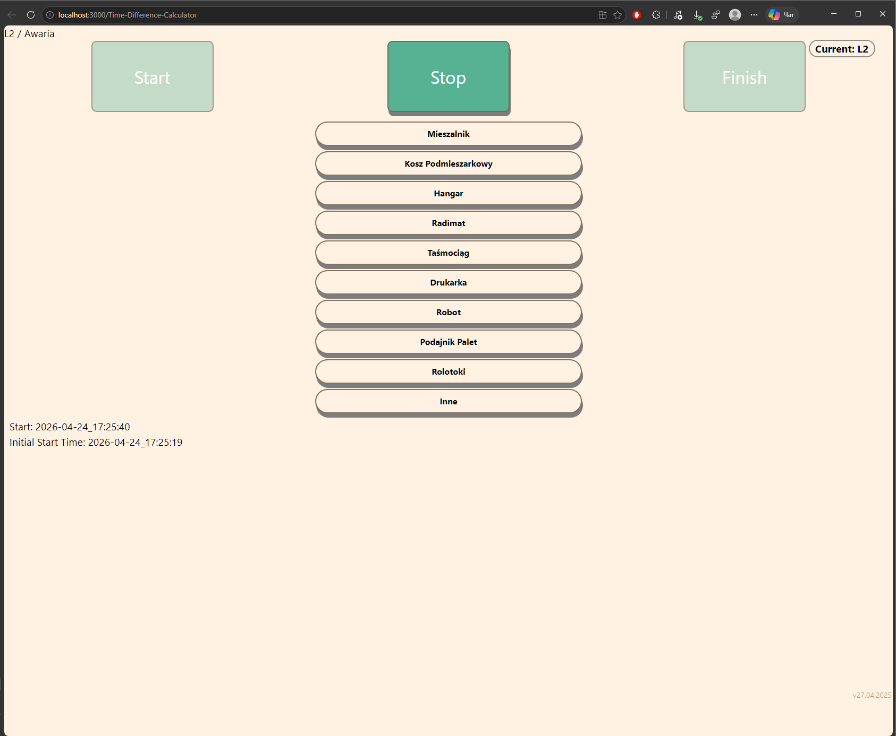
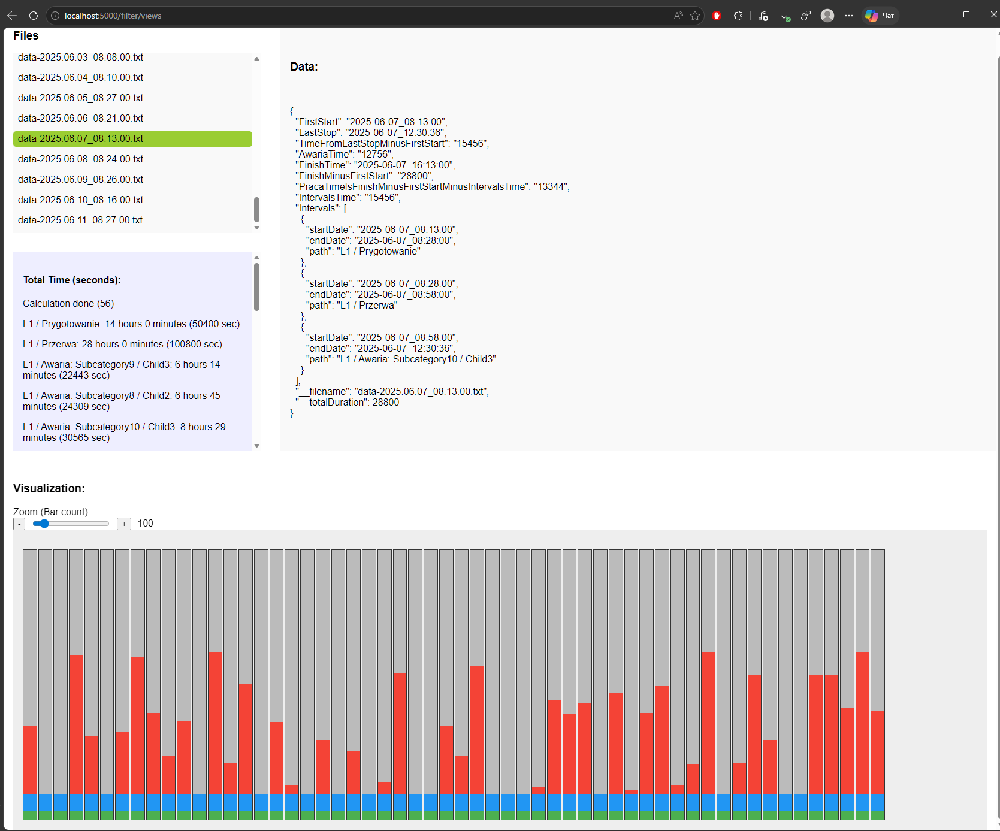

# Timer App

## Overview
Timer App is a small React + Node.js project for authenticated time tracking and session analysis. The app is designed to record tasks, downtime, and failure periods, then save the final timing results to the server and email them for review.

## What it does
- Authenticates users with username/password and JWT-based refresh tokens.
- Uses browser fingerprinting to bind sessions to specific devices.
- Displays a hierarchical task tree loaded from `client/src/data.json`.
- Tracks start/stop times, pauses, and failures in a structured workflow.
- Computes work duration, total elapsed time, failure time, and interval summaries.
- Saves result data on the server and writes it to a timestamped file.
- Sends the saved file to a configured email address.

## Project structure
- `client/` — React frontend
- `server/` — Express backend
- `docker-compose.yml` — optional container configuration

## Quick start
1. Open one terminal for the client and another for the server.

2. Start the client:
   ```bash
   cd client
   npm install
   npm run start
   ```

3. Start the server:
   ```bash
   cd server
   npm install
   node server.js
   ```

## Authentication frontend
The login flow uses these test users:
- `user1` / `123`
- `user2` / `234`

## Authentication backend
The login flow uses these test users:
- `admin` / `1234`

After login, the server sets a `refreshToken` cookie and the frontend stores an `accessToken` in local storage.

## Main frontend routes
- `/Time-Difference-Calculator` — main timer page
- `/Time-Difference-Calculator/login` — login page
- `/Time-Difference-Calculator/sourse` — informational/help page

## Backend endpoints
- `POST /api/login` — user login
- `POST /api/logout` — clear refresh token cookie
- `GET /checkAuth` — verify refresh token
- `GET /check-devices` — verify device fingerprint + refresh token
- `POST /save-devices` — save a new device fingerprint
- `POST /save-time-data` — persist time tracking data to a file
- `GET /get-time-data` — read the last saved time data file

## How time tracking works
The main tracking flow records:
- `FirstStart` — the first task start time
- `LastStop` — the last stop time
- `FinishTime` — finish timestamp
- `Intervals` — each recorded time interval with a path
- `AwariaTime` — sum of failure intervals
- `PracaTimeIsFinishMinusFirstStartMinusIntervalsTime` — actual productive time

## Server notes
- The server reads `allowed-origin.txt` and reloads origins automatically when the file changes.
- Saved time data is written as a timestamped `.txt` file in `server/routes/`.
- The server emails the saved payload using Gmail SMTP credentials from `.env`.

## Screenshots

| Login screen | Timer screen | Task tree | Issue | Server log |
|-------------|------------|-----------|--------|---------|
|  |  |  |  |  |

## Notes
- Make sure both client and server dependencies are installed before running.
- Restart the server after changing authentication or CORS settings.
- If the app is running in production, update the SMTP credentials and CORS origins accordingly.


Developed and maintained a full-stack time-tracking application using React, TypeScript, Express, and Node.js.
Implemented JWT-based authentication with refresh token cookies and device fingerprint validation for secure session binding.
Built a hierarchical task flow UI that tracks start/stop intervals, downtime, failure events, and computes productive vs total elapsed time.
Designed backend logic to persist time data as timestamped files and automatically email results via SMTP.
Configured CORS origin management, request logging, and secure cookie handling for a local client-server workflow.